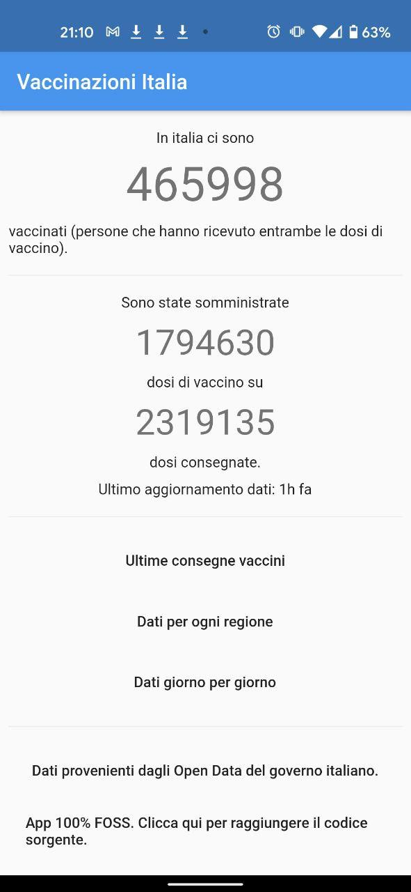
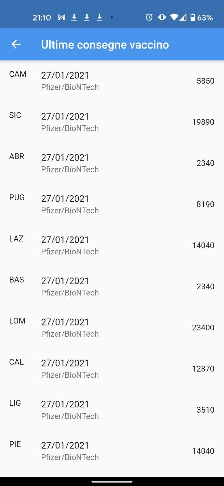
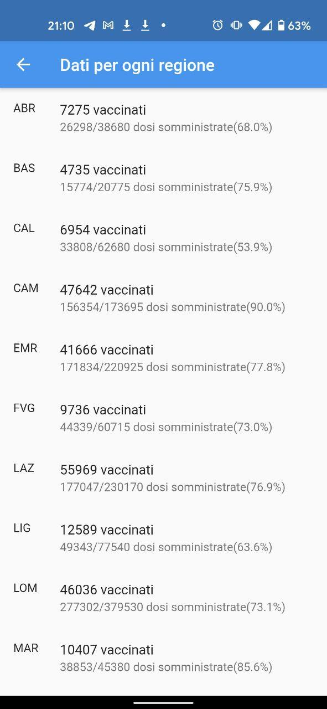
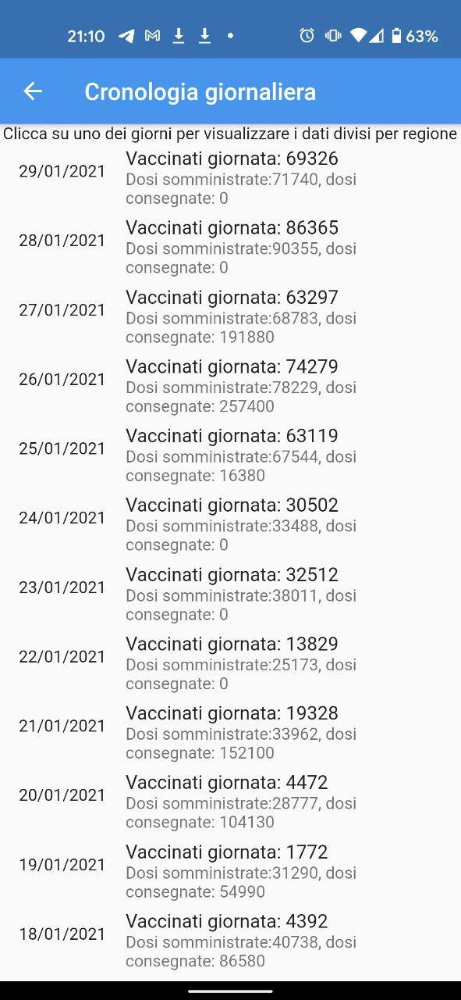
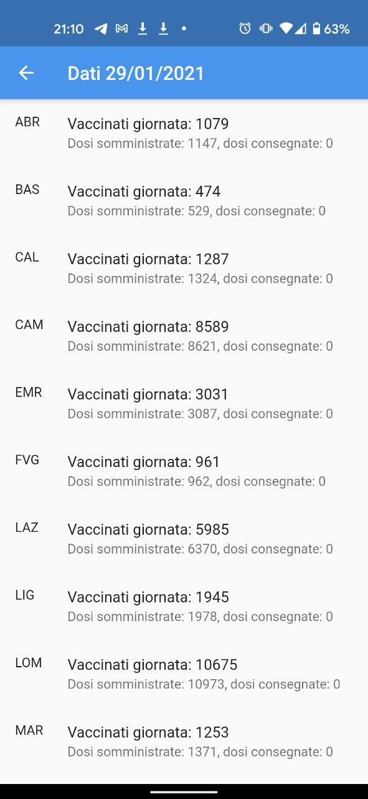
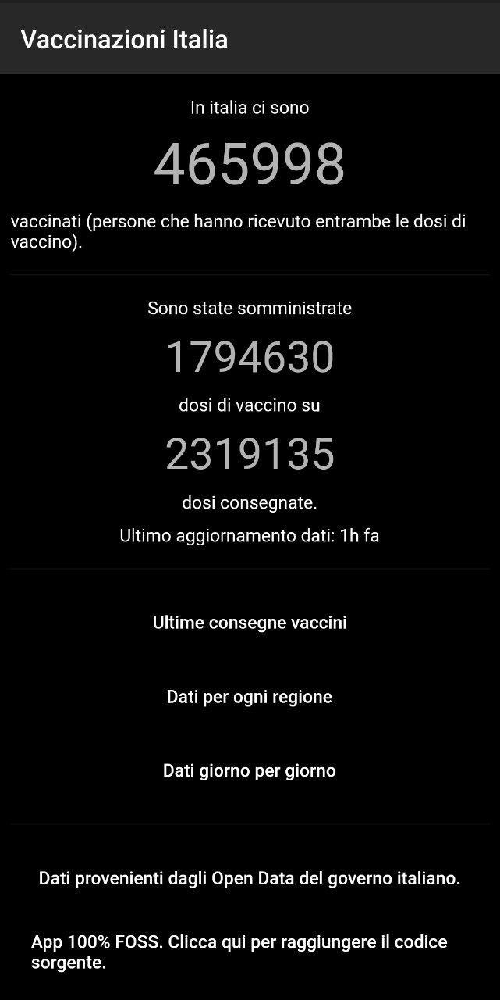
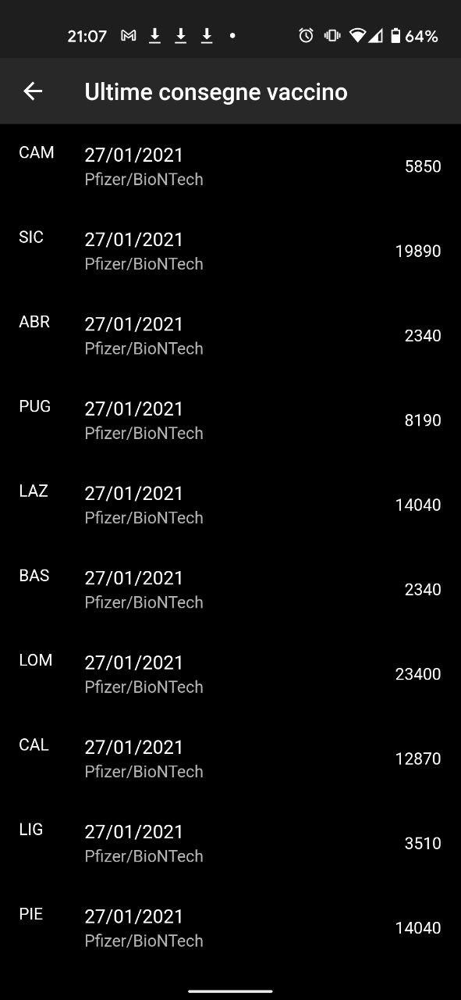
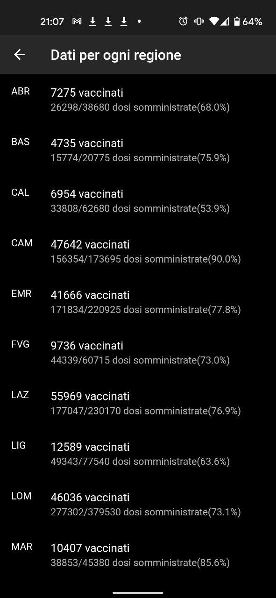
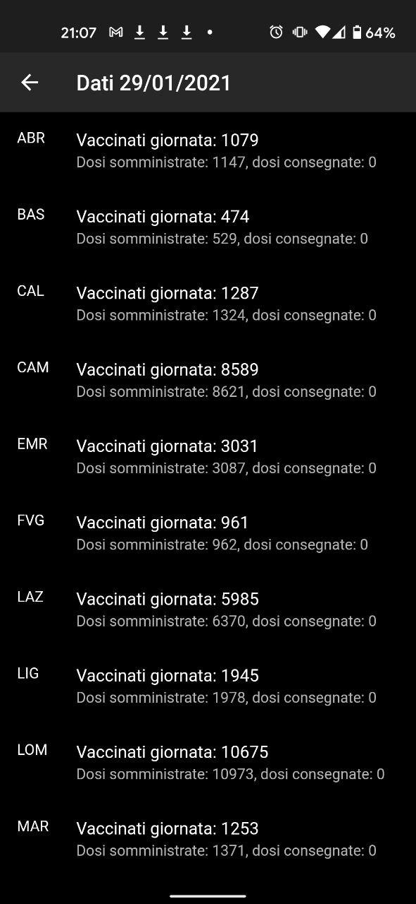
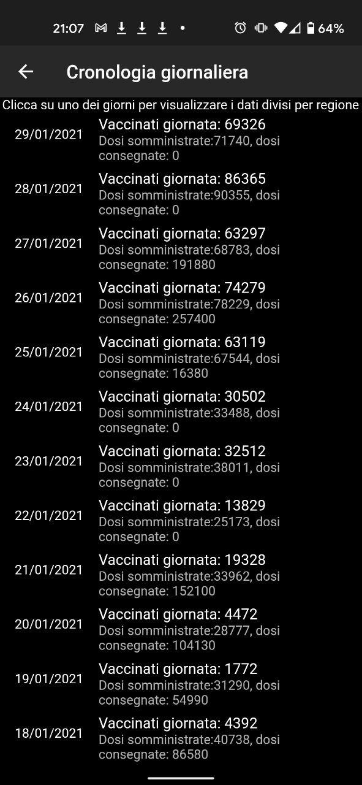

# Vaccitaly

Ora sul Google Play Store:

https://play.google.com/store/apps/details?id=com.carminezacc.vaccitaly

Semplice app che mostra gli Open Data del governo sulle vaccinazioni attualmente in corso in una maniera che si concentra sui dati che mi sembrano più di interesse rispetto a quelli mostrati nel report ufficiale governativo.

Essendo stata sviluppata frettolosamente nelle sere dei giorni precedenti a quello in cui scrivo da una sola persona senza un chiaro piano per gli sviluppi futuri né l'intenzione effettivamente di pubblicarla, l'app è piena di spaghetti code e code duplication, oltre a non presentare l'UI più gradevole possibile.

Tema chiaro:

Tema scuro:

[L'app usa gli Open Data pubblicati dal Commissario straordinario per l'emergenza Covid-19 - Presidenza del Consiglio dei Ministri](https://github.com/italia/covid19-opendata-vaccini) con licenza [CC BY 4.0](https://creativecommons.org/licenses/by/4.0/deed.it). Questa nota è presente in ottemperanza ai vincoli imposti da tale licenza.
